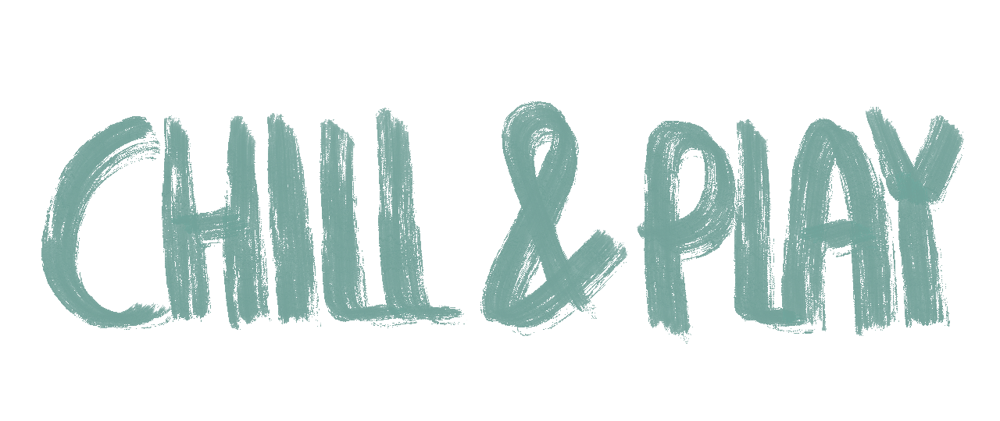

## Demo
Click here and enjoy :sunglasses: :
 [Chill&Play](https://sapienzainteractivegraphicscourse.github.io/final-project-chillandplay/) 

## How to play
Select the minigame you want to play.

Choose the frog if you want to play as a fly that bothers it while trying to not get eaten.
Move the mouse to pull the fly around the screen. You can pass through different game
areas, in which the fly is always followed by the frog’s gaze. The closer you get to the frog,
the more dangerous it becomes.

Choose the sheep if you want to feel like a farmer who needs to shear his sheep. Like a real
farmer, grab the scissors and move them over the sheep to remove the wool tufts. Once the
wool is removed it falls on the ground and disappears. You can click and drag, or use the
arrow keys, to rotate the sheep to not miss any spot.

## Documentation
Here you can find the project report: [Chill&PlayReport.pdf](https://github.com/SapienzaInteractiveGraphicsCourse/final-project-chillandplay/blob/main/Report.pdf).

## Authors
* [Mario Cosimo Angelini](https://github.com/2029254) [2029254]
* [Daniela Rieti](https://github.com/danielarieti) [1762973]
* [Laura Papi](https://github.com/laurapapi) [1760732]
* [Francesca Restante](https://github.com/francescarestante) [1745106]
